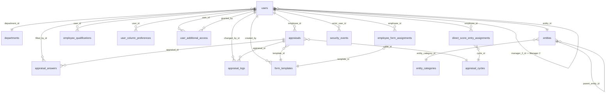
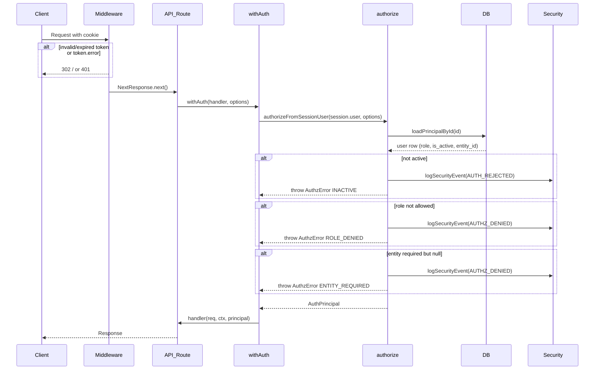
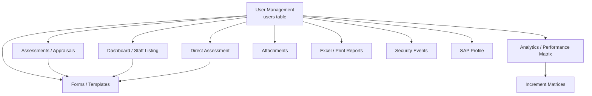
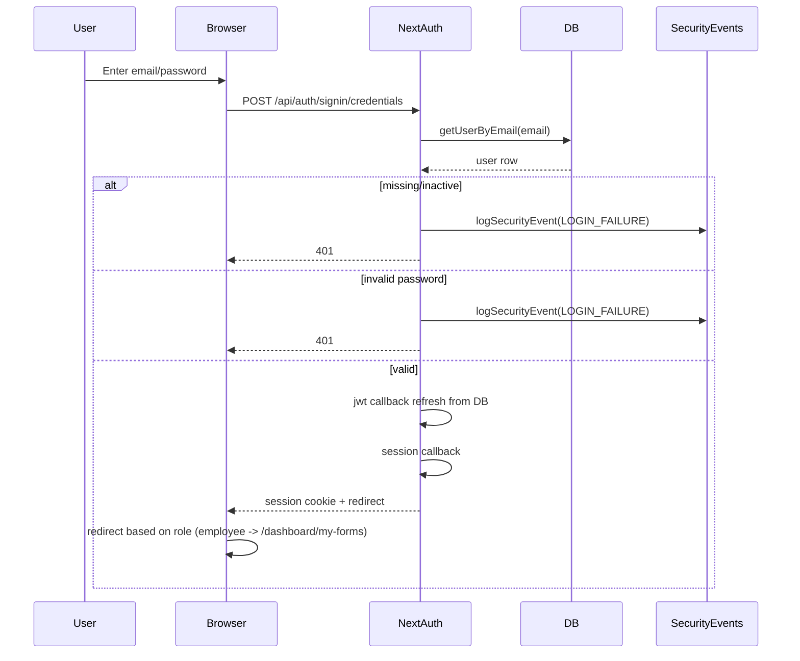
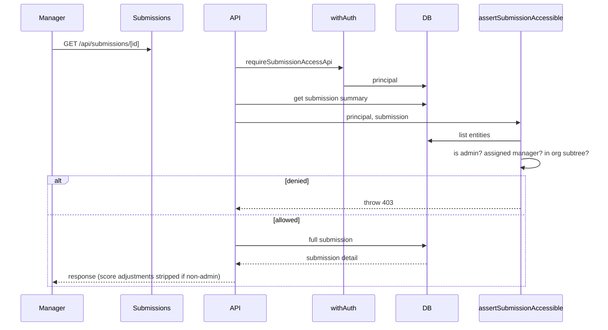
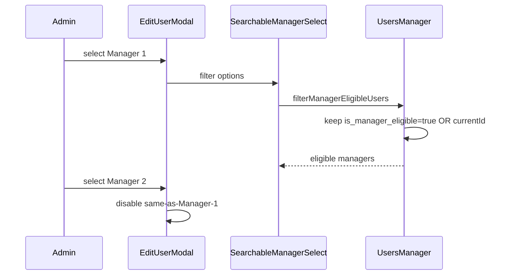

# PMS User Management — Complete Architectural Analysis

**Project:** Performance Management System (PMS) — University of Lahore
**Target Migration Project:** IREB System
**Analysis Date:** 2026-08-05
**Scope:** Documentation / analysis only — no code changed

---

## Executive Summary

The PMS User Management module is the central security and workflow pillar of the application. Every other domain — forms, appraisals, dashboard, direct assessment, performance matrices, security audit, attachments — is anchored to the `users` table and the `system_role` it carries. The architecture combines a PostgreSQL role-based schema, a NextAuth-powered JWT session layer, a dual reporting hierarchy (Manager 1 / Manager 2), a three-level entity org tree, and a supplementary "Additional Access" permission overlay that lets non-admin users be granted VIEW_ONLY or EDIT rights to specific modules.

Key design principles observed:

1. **Database is the source of truth for authorization** — JWT tokens are refreshed from PostgreSQL on every request.
2. **Dual org-mode support** — the system can run in legacy `department_id` mode or modern `entity_id` mode and detects which at runtime.
3. **Manager eligibility is explicit** — only users with `is_manager_eligible = TRUE` can appear in manager dropdowns (with a fallback that preserves existing assignments).
4. **RBAC is primary, Additional Access is supplementary** — SUPER_ADMIN / HR / BOARD always win; MANAGER and EMPLOYEE roles can be extended per module.
5. **Hard-coded role hierarchy** — there is no dynamic permission table; roles are an enum and helpers are hard-coded around `ROLE_PERMISSION_SETS`.

For the IREB migration, the schema, RBAC helpers, page guards, and query patterns can be reused almost verbatim if IREB also needs 5 fixed roles and module-level permission overlays. The parts most likely to require redesign are the PMS-specific fields (`emp_category`, `emp_sub_category`, `grade_group`, date-of-joining eligibility, SAP integration, and the appraisal workflow) because these are tightly coupled to UoL's performance-management domain.

---

## 1. Overall Architecture

### 1.1 How Users Are Managed

Users are managed through a single `/dashboard/users` admin page guarded by the highest privilege level. The `users` table stores identity, authentication, role, org assignment, reporting lines, and activity state. Profile enrichment (qualifications, additional access, column preferences) lives in satellite tables. The system supports:

- Manual user creation/editing through the admin UI
- Bulk editing of staff fields
- Manager assignment with eligibility gating
- Additional access grants
- SAP lookup during creation (optional)
- Activation/lock via `is_active`

### 1.2 End-to-End Flow

```
PostgreSQL (users + related tables)
        |
        v
lib/queries/*.ts  (server-side SQL/CRUD)
        |
        v
app/api/admin/users/*  (REST endpoints with guards)
        |
        v
lib/queries/users-client.ts  (TanStack Query / fetch wrappers)
        |
        v
app/components/users/*  (React UI)
        |
        v
NextAuth session  (JWT + cookie, DB-refreshed)
        |
        v
app/dashboard/users/page.tsx  (server page guard)
```

### 1.3 Relationship with Every Module

| Module | User-field dependency | Nature of relationship |
|--------|----------------------|----------------------|
| **Appraisals / Submissions** | `employee_id`, `head_id`, `manager_2_id`, `entity_id`, `emp_category`, `emp_sub_category` | Workflow routing, reviewer assignment, visibility scoping |
| **Forms / Templates** | `created_by`, `employee_form_assignments.employee_id` | Form creation ownership, explicit per-employee assignment |
| **Dashboard / Staff Listing** | `entity_id`, `designation`, `role_category`, `head_id`, `manager_2_id` | Filtering, searching, column display, entity cascade |
| **Direct Assessment** | `employee_id`, `head_id`, `manager_2_id`, `entity_id` | Direct score entry assignments and editing scope |
| **Performance Matrices** | `employee_id` (via appraisals) | Mapping scores to levels/quartiles, increment assignment |
| **Security Events** | `actor_user_id` | Audit log of who triggered auth events |
| **Attachments** | `filled_by_id` | Ownership of uploaded form attachments |
| **Qualifications** | `user_id` | 1:N profile extension |
| **Additional Access** | `user_id`, `granted_by` | Per-module permission overlay |
| **Column Preferences** | `user_id` | Per-user table layout persistence |
| **SAP Profile** | `employee_id` | External HR lookup during provisioning |

---

## 2. Database Design

### 2.1 Core User Table

```sql
CREATE TABLE users (
    id BIGSERIAL PRIMARY KEY,
    employee_id VARCHAR(30) UNIQUE NOT NULL, -- SAP Code
    email VARCHAR(150) UNIQUE NOT NULL,
    password_hash VARCHAR(255) NOT NULL,
    first_name VARCHAR(50) NOT NULL,
    last_name VARCHAR(50) NOT NULL,
    designation VARCHAR(150),
    role_category VARCHAR(150),
    grade_group VARCHAR(50),
    date_of_joining DATE,
    system_role user_role NOT NULL DEFAULT 'EMPLOYEE',
    emp_category employee_category NOT NULL,
    emp_sub_category sub_category NOT NULL,
    department_id INT REFERENCES departments(id) ON DELETE RESTRICT,
    entity_id BIGINT REFERENCES entities(id) ON DELETE RESTRICT,
    head_id BIGINT REFERENCES users(id) ON DELETE SET NULL, -- Manager 1
    manager_2_id BIGINT REFERENCES users(id) ON DELETE SET NULL, -- Manager 2
    is_manager_eligible BOOLEAN NOT NULL DEFAULT FALSE,
    is_active BOOLEAN DEFAULT TRUE,
    created_at TIMESTAMPTZ DEFAULT CURRENT_TIMESTAMP
);
```

| Field | Why it exists |
|-------|---------------|
| `employee_id` | SAP / external HR code; public-facing employee identifier |
| `email` | Login identifier; unique across the system |
| `password_hash` | Bcrypt hash for credential logins |
| `first_name` / `last_name` | Display name and session `name` |
| `designation` | Free-text job title (filter facet, display) |
| `role_category` | Free-text PMS role category (not system_role) used in dashboard filters |
| `grade_group` | HR grade group from SAP/excels |
| `date_of_joining` | Used for appraisal-eligibility calculation |
| `system_role` | RBAC enum: EMPLOYEE, MANAGER, HR, BOARD, SUPER_ADMIN |
| `emp_category` / `emp_sub_category` | Legacy staff category + sub-category; used for form routing historically |
| `department_id` | Legacy flat org assignment |
| `entity_id` | Modern hierarchical org assignment (replaces department_id in newer deployments) |
| `head_id` | Self-referential FK: Manager 1 for appraisal reviews |
| `manager_2_id` | Self-referential FK: optional Manager 2 for second-level reviews |
| `is_manager_eligible` | Gate for manager dropdowns; only eligible users can be assigned as Manager 1/2 |
| `is_active` | Soft lock; inactive users cannot authenticate |
| `created_at` | Audit trail |

### 2.2 User-Related Tables

| Table | Purpose | Key FK to users | ON DELETE |
|-------|---------|-----------------|-----------|
| `departments` | Legacy flat org units | `users.department_id` | RESTRICT |
| `entity_categories` | Org level labels (C1, C2, C3) | — | — |
| `entities` | Hierarchical org units | `users.entity_id` | RESTRICT |
| `employee_qualifications` | 1:N education records | `user_id` | CASCADE |
| `user_column_preferences` | Per-user table config (JSONB) | `user_id` | CASCADE |
| `user_additional_access` | Per-module VIEW_ONLY/EDIT grants | `user_id`, `granted_by` | CASCADE / SET NULL |
| `employee_form_assignments` | Explicit form-to-user mapping | `employee_id` | CASCADE |
| `direct_score_entry_assignments` | Direct score entry flag per cycle | `employee_id` | CASCADE |
| `appraisals` | Appraisal record per employee/cycle | `employee_id` | CASCADE |
| `appraisal_answers` | Who filled each answer | `filled_by_id` | *(no explicit FK in schema)* |
| `appraisal_logs` | Who changed the appraisal | `changed_by_id` | *(no explicit FK in schema)* |
| `form_templates` | Who created the template | `created_by` | *(no explicit FK in schema)* |
| `security_events` | Security audit log | `actor_user_id` | SET NULL |

### 2.3 Indexes

| Index | On | Columns | Why |
|-------|----|---------|-----|
| `idx_users_role_dept` | users | (system_role, department_id) | Legacy role/department filtering |
| `idx_users_entity_id` | users | (entity_id) | Entity-based lookups |
| `idx_users_head_id` | users | (head_id) | Manager 1 subordinate lookups |
| `idx_users_manager_2_id` | users | (manager_2_id) | Manager 2 subordinate lookups |
| `idx_entities_parent` | entities | (parent_entity_id) | Tree traversal |
| `idx_employee_qualifications_user` | employee_qualifications | (user_id) | Profile load |
| `idx_user_additional_access_user` | user_additional_access | (user_id) | Permission load |
| `idx_appraisals_cycle_status` | appraisals | (cycle_id, status) | Dashboard filtering |

### 2.4 Database Relationship Diagram (Mermaid)



---

## 3. User Roles

The system defines exactly 5 roles in the `user_role` PostgreSQL enum and `types/users.ts`:

### 3.1 EMPLOYEE

- **Permissions:** View and fill own assigned forms; view own additional access; view own profile.
- **Restrictions:** No dashboard, no staff listing, no user management, no submissions review, no score adjustments.
- **Workflow:** Self-assessment step only.
- **Accessible pages:** `/dashboard/my-forms/*`, `/dashboard/forms/*` (subject to additional access), `/dashboard/profile`.
- **Accessible APIs:** `/api/my-forms/*`, `/api/me/*`, own submission GET.
- **Hidden features:** Manager review, HR calibration, score adjustments, quartiles.

### 3.2 MANAGER (Product language: "Head")

- **Permissions:** View dashboard and staff listing scoped to entity subtree and/or direct reports; review submissions where assigned as Manager 1 or Manager 2; enter direct assessment scores if assigned.
- **Restrictions:** No user management; no bulk user edit (unless additional access); no HR/Board approval; quartile data hidden.
- **Workflow:** Manager review level 1 or 2 in appraisal flow.
- **Accessible pages:** `/dashboard`, `/dashboard/submissions/*` (assigned), `/dashboard/forms/*` (additional access).
- **Accessible APIs:** `/api/submissions/*` (conditional), `/api/templates/*/direct-assessment` (conditional).
- **Hidden features:** User Management, security events, entity admin.

### 3.3 HR

- **Permissions:** Full dashboard; review/calibrate all submissions; manage forms, entities, matrices, financial years, appraisal cycles, institutional quotas; bulk edit staff; run role-category inline edits.
- **Restrictions:** Cannot manage users (only SUPER_ADMIN can create/edit/delete users and grant additional access).
- **Workflow:** HR calibration step; can adjust scores and apply calibration.
- **Accessible pages:** All except `/dashboard/users` and `/dashboard/security-events`.
- **Accessible APIs:** All admin/config APIs except user CRUD and security events.

### 3.4 BOARD

- **Permissions:** Same operational domain as HR; board approval step; final sign-off.
- **Restrictions:** Same as HR — user management and security events are SUPER_ADMIN only.
- **Workflow:** Board approval step.
- **Accessible pages:** Same as HR.

### 3.5 SUPER_ADMIN

- **Permissions:** Everything. Only role that can create/edit/delete users, lock/activate users, assign roles, assign additional access, and view security events.
- **Restrictions:** None.
- **Workflow:** User lifecycle, global configuration.
- **Accessible pages:** All, including `/dashboard/users`, `/dashboard/security-events`.
- **Accessible APIs:** All admin endpoints, including `requireTrueSuperAdmin*` guards.

---

## 4. RBAC Architecture

### 4.1 How Permissions Are Checked

The PMS uses a hard-coded, role-enum-based permission model. There is no dynamic permission table. Permission logic is expressed through small, composable helper functions in `lib/auth/`.

**Permission flow (server API):**

```
Request
  -> NextAuth session cookie
    -> middleware.ts (edge: token exists and no error)
      -> route handler
        -> withAuth / require* guard
          -> getServerSession
          -> authorizeFromSessionUser(session.user)
            -> loadPrincipalById (DB refresh)
            -> validate role in allowed list
            -> validate is_active
            -> optionally require entity_id
          -> handler executes with principal
```

### 4.2 Helper Functions

| File | Function | Purpose |
|------|----------|---------|
| `lib/auth/roles.ts` | `isAdminRole`, `canReviewSubmissions`, `canAccessDashboardSubmissions`, `roleSatisfies` | Hard-coded role checks |
| `lib/auth/authorize.ts` | `loadPrincipalById`, `loadPrincipalByEmail`, `authorizeFromSessionUser`, `assertSelfOrRoles` | DB-backed principal resolution and role gating |
| `lib/auth/with-auth.ts` | `withAuth` | HOF that wraps route handlers and injects principal |
| `lib/auth/additional-access.ts` | `getEffectiveModuleAccess`, `canViewModule`, `canEditModule` | Supplementary module access lookup |
| `lib/auth/require-super-admin.ts` | `requireTrueSuperAdminApi` / `Session` | True SUPER_ADMIN only |
| `lib/auth/require-submission-reviewer.ts` | `requireSubmissionReviewerApi`, `requireSubmissionAccessApi` | Submission reviewer vs. viewer gating |
| `lib/auth/require-module-access.ts` | `requireModuleViewApi`, `requireModuleEditApi` | Additional-access-aware module guards |

### 4.3 Middleware

`middleware.ts` uses NextAuth's `withAuth` to protect:
- `/dashboard/:path*`
- `/api/((?!auth).*)`  (all API routes except `/api/auth/*`)

The middleware only validates the session cookie and token error state. It does **not** do role checks — role gating happens inside the route handler via the `require*` helpers.

### 4.4 Frontend Guards

| Guard | Location | Behavior |
|-------|----------|----------|
| `requireSuperAdminSession` | page-level server component | Allows SUPER_ADMIN / HR / BOARD, redirects others to `/dashboard` |
| `requireTrueSuperAdminSession` | page-level server component | SUPER_ADMIN only |
| `EmployeeAccessGuard` | client layout component | Restricts EMPLOYEE to `/dashboard/my-forms` and `/dashboard/forms` paths |
| `useAdditionalAccess` hook | client | Fetches own additional access and exposes `canView` / `canEdit` |

### 4.5 API Authorization

API authorization is implemented per route. Example patterns:

- `requireTrueSuperAdminApi()` for user CRUD and additional access
- `requireSuperAdminApi()` for org-wide config (misleading name — allows HR/BOARD too)
- `requireSubmissionReviewerApi()` for bulk/submission reviewer operations
- `requireSubmissionAccessApi()` for opening a single submission
- `withAuth(handler, { roles: ROLE_PERMISSION_SETS.dashboard })` for dashboard data

### 4.6 Component Authorization

UI elements use `canReviewSubmissions(session.user.role)`, `isAdminRole(role)`, and `canEditModuleClient(module, role, permissions)` to conditionally render fields, buttons, or columns. Column visibility is also filtered via `allowedColumnIds` computed from role + additional access.

### 4.7 Complete Permission Flow Diagram



---

## 5. User Creation

### 5.1 Endpoint

`POST /api/admin/users` — guarded by `requireSuperAdminApi()` (actually allows SUPER_ADMIN / HR / BOARD in the deprecated helper).

### 5.2 Validation

Server validation in `lib/validation/users.ts`:

| Field | Required | Constraints |
|-------|----------|-------------|
| `employeeId` | Yes | string, max 30, non-empty |
| `email` | Yes | string, max 150, valid email format, lowercased |
| `password` | Yes | min 8 chars (create only) |
| `firstName` | Yes | max 50 |
| `lastName` | Yes | max 50 |
| `systemRole` | Yes | one of the 5 enum values |
| `empCategory` | Yes | non-empty |
| `empSubCategory` | Yes | non-empty |
| `entityId` | No | positive integer or null; entity must exist |
| `headId` | No | positive integer or null; user must be manager-eligible |
| `manager2Id` | No | positive integer or null; user must be manager-eligible; cannot equal headId |
| `designation` | No | free text, trimmed or null |
| `roleCategory` | No | free text, trimmed or null |
| `dateOfJoining` | No | valid ISO date or null |
| `isManagerEligible` | No | boolean, default false |
| `isActive` | No | boolean, default true |
| `qualification*` | No | stored in `employee_qualifications` as primary |

### 5.3 Business Rules

- Email is normalized to lowercase before insert.
- Password hashed with `bcrypt` (10 rounds).
- `headId` and `manager2Id` must point to users where `is_manager_eligible = TRUE`.
- Manager 1 and Manager 2 cannot be the same person.
- If the entity column is missing, the system falls back to `department_id`.
- Creation also optionally assigns form templates and additional access in a follow-up step in the UI.

### 5.4 Default Values

- `system_role` defaults to `EMPLOYEE`.
- `is_manager_eligible` defaults to `FALSE`.
- `is_active` defaults to `TRUE`.
- Optional text fields become `NULL` if blank.

---

## 6. User Editing

### 6.1 Endpoint

`PUT /api/admin/users/[id]` — same guard as create.

### 6.2 Editable Fields

Every field listed in the `UpdateUserInput` schema is editable:

- `employeeId`, `email`, `firstName`, `lastName`
- `systemRole` — can elevate/demote user (subject to who is editing)
- `empCategory`, `empSubCategory`
- `entityId` — organization reassignment
- `headId` (Manager 1) — must be manager-eligible unless unchanged
- `manager2Id` (Manager 2) — must be manager-eligible unless unchanged; cannot equal headId
- `isManagerEligible` — controls whether user appears in manager dropdowns
- `designation`, `roleCategory`, `gradeGroup`, `dateOfJoining`
- `qualification*` fields — upserted into `employee_qualifications`
- `isActive` — lock/unlock account
- `password` — optional; only re-hashed if provided and >= 8 chars

### 6.3 Edit Logic

The `updateUser` query in `lib/queries/users.ts` loads the existing user, runs `assertValidManagers` with previous values, and allows an unchanged manager assignment to bypass the eligibility check (so legacy assignments are not broken when eligibility is enforced later).

---

## 7. Organization Hierarchy

### 7.1 Org Levels

The modern hierarchy is a self-referential `entities` table with categories `C1`, `C2`, `C3`:

- **C1** — top level (e.g. Campus, Rectorate)
- **C2** — middle level (e.g. Faculty, Directorate)
- **C3** — leaf level (e.g. Department, Center)

A user belongs to exactly one leaf entity via `users.entity_id`.

### 7.2 Users Belong to Organizations

- `users.entity_id` is the primary org link.
- `users.department_id` is legacy and used only in older deployments.
- `getUserOrgMode()` at runtime detects whether `entity_id` exists to decide which mode to use.

### 7.3 Filters Use the Hierarchy

Dashboard and Users page filters use `c0`, `c1`, `c2` query parameters mapped to entity IDs. `resolveEntitySubtreeIds(rootId)` walks the `parent_entity_id` tree to return all descendants. Filtering then checks `u.entity_id = ANY($scopedIds)`.

### 7.4 Entity vs Department Mode

The codebase is dual-mode to support migration. New deployments should use `entity_id` only. The fallback `department_id` mode is a flat list of departments with no hierarchy.

---

## 8. Reporting Structure

### 8.1 Manager 1

- Field: `users.head_id`
- Purpose: Direct reporting manager; primary reviewer for appraisals.
- Assignment: Only users with `is_manager_eligible = TRUE` appear in the Manager 1 dropdown.

### 8.2 Manager 2

- Field: `users.manager_2_id`
- Purpose: Optional second-level reviewer.
- Constraints: Cannot be the same user as Manager 1; must be manager-eligible (unless already assigned).

### 8.3 Why Only Manager-Eligible Users Appear

The UI calls `filterManagerEligibleUsers(users, currentId?)` before populating the dropdown. This ensures only qualified staff can be assigned as managers. The `currentId` fallback preserves an existing manager even if their eligibility flag was later removed.

### 8.4 How Reporting Hierarchy Is Built

When an appraisal is created, the system reads `head_id` and `manager_2_id`. The workflow advances as:

1. `PENDING_SELF_ASSESSMENT` (if enabled)
2. `PENDING_HEAD_REVIEW` — Manager 1 reviews
3. If `manager_2_id` exists and current `manager_level = 1`, advance to `PENDING_HEAD_REVIEW` with `manager_level = 2`
4. After final manager, advance to `PENDING_HR_CALIBRATION`
5. Then `PENDING_BOARD_APPROVAL`
6. Then `APPROVED` / `COMPLETED`

---

## 9. Additional Access

### 9.1 Modules

Defined in `types/additional-access.ts`:

- `FORMS`
- `CREDIT_HOURS`
- `ORIC_ADJUSTMENTS`
- `QEC_ADJUSTMENTS`

### 9.2 Access Levels

- `VIEW_ONLY` — read but not edit
- `EDIT` — read and write

### 9.3 Database

```sql
CREATE TABLE user_additional_access (
    id BIGSERIAL PRIMARY KEY,
    user_id BIGINT NOT NULL REFERENCES users(id) ON DELETE CASCADE,
    module VARCHAR(50) NOT NULL,
    access_level VARCHAR(20) NOT NULL CHECK (access_level IN ('VIEW_ONLY','EDIT')),
    granted_by BIGINT REFERENCES users(id) ON DELETE SET NULL,
    created_at TIMESTAMPTZ DEFAULT CURRENT_TIMESTAMP,
    updated_at TIMESTAMPTZ DEFAULT CURRENT_TIMESTAMP,
    CONSTRAINT unique_user_module UNIQUE (user_id, module)
);
```

### 9.4 Permission Checks

`getEffectiveModuleAccess(userId, module, role)`:
- If role is `SUPER_ADMIN`, `HR`, or `BOARD` → returns `EDIT` immediately.
- Else loads `user_additional_access` for the user and returns the matching level or `null`.

### 9.5 UI Rendering

Client-side `useAdditionalAccess` hook fetches the current user's permissions. `canViewModuleClient` / `canEditModuleClient` decide whether to render buttons, cells, or menu items. Dashboard column visibility is also extended by `ADDITIONAL_ACCESS_MODULE_COLUMNS` mapping.

### 9.6 Backend Validation

`requireModuleViewApi` and `requireModuleEditApi` enforce additional access on server routes. Non-admin users are 403'd if they lack the required level. Admin users always pass.

---

## 10. Authentication

### 10.1 Login

Two NextAuth providers in `auth.ts`:
- **Credentials** — email/password verified with bcrypt.
- **Google OAuth** — email must already exist in `users` and be active.

### 10.2 Session / JWT / Cookies

- Strategy: `jwt`
- Max age: 8 hours
- Cookie: `__Secure-next-auth.session-token` in production, `next-auth.session-token` in dev; `httpOnly`, `sameSite: lax`, `secure` only in production.
- JWT callback refreshes `id`, `role`, `entityId`, `designation` from the DB on **every request**.
- If the DB user is inactive or missing, the token is cleared and `error: "InactiveOrMissingUser"` is set.

### 10.3 Refresh

Refresh happens automatically in `jwt` callback. No explicit refresh endpoint.

### 10.4 Logout

NextAuth `/api/auth/signout` clears the cookie.

### 10.5 Middleware Guard

`middleware.ts` redirects to `/` if the token has `error` or no `id`.

---

## 11. Staff Listing

Staff Listing is the main dashboard view (`/dashboard`) for non-employee roles.

### 11.1 How Users Appear

The overview query joins `users` to `appraisals` and applies `appendStaffVisibilityClause`:

- SUPER_ADMIN / HR / BOARD: all staff
- MANAGER: staff in entity subtree **or** staff where viewer is `head_id` or `manager_2_id`
- EMPLOYEE: redirected away; does not use Staff Listing

### 11.2 Features

- **Search** — by name, employee ID, email
- **Filters** — entity C0/C1/C2 cascade, role category, designation, form status
- **Master filter** — per-column Excel-style filters with facet counts
- **Sorting** — server-side via query parameters
- **Bulk edit** — multi-select rows, open `BulkEditStaffModal`
- **Column management** — show/hide, reorder, freeze, resize
- **Excel export** — `ExcelExportButton` with `ExportColumnSelectorModal`
- **Print** — print-optimized layout components
- **RBAC** — column visibility and editable fields gated by role

---

## 12. User Management Module

### 12.1 Page

`/dashboard/users` guarded by `requireSuperAdminSession()` (allows SUPER_ADMIN / HR / BOARD).

### 12.2 Components

| Component | Responsibility |
|-----------|---------------|
| `UsersManager` | Container: tabs, form, create/edit flow, mutations |
| `UsersListingTable` | Paginated table, master filters, selection, export, delete |
| `EditUserModal` | Edit form, additional access, form template assignment |
| `SearchableManagerSelect` | Searchable manager dropdown |
| `BulkEditStaffModal` | Bulk edit of staff fields |

### 12.3 Features

- **Search** — name, SAP code, email
- **Filters** — entity cascade, role category, designation
- **Master filter** — column-level filters
- **Pagination** — 50 rows/page, API fetches details per page
- **Bulk edit** — role category, designation, entity, qualification, score adjustments, managers, assessment eligibility, template assignment
- **Create** — full form with manager/eligibility/qualification
- **Delete** — hard delete with foreign-key conflict message; cannot delete self
- **Lock/Status** — `isActive` toggle in edit form
- **Column management** — same `ColumnManagementPanel` pattern as Staff Listing
- **Excel export** — full or filtered dataset

---

## 13. Dependencies

### 13.1 Assessments / Appraisals

- Uses `employee_id`, `head_id`, `manager_2_id`, `entity_id`, `emp_category`, `emp_sub_category`
- One appraisal per employee per cycle; cascade delete on user delete

### 13.2 Forms / Templates

- `form_templates.created_by` tracks template author
- `employee_form_assignments.employee_id` links users to forms

### 13.3 Dashboard

- Staff listing, charts, and filters all driven by `users` joined to `appraisals`

### 13.4 Direct Assessment

- `direct_score_entry_assignments.employee_id` marks employees for direct score entry
- Edit scope depends on `head_id` / `manager_2_id` and entity subtree

### 13.5 Analytics / Performance Matrix

- Appraisal scores feed performance levels, quartiles, and increment matrices
- `increment_matrices` and `employee_increment_matrix_assignments` reference users

### 13.6 Attachments

- `appraisal_answer_attachments.filled_by_id` records who uploaded a file

### 13.7 Reports

- Excel export uses user fields and score data

### 13.8 Security Events

- `security_events.actor_user_id` records auth/authorization anomalies

### 13.9 SAP Profile

- External SAP lookup seeds `employee_id`, `first_name`, `last_name`, `email`, `designation`, `department` during creation

### 13.10 Dependency Map (Mermaid)



---

## 14. APIs

### 14.1 User CRUD

| Method | Endpoint | Authorization | Purpose |
|--------|----------|---------------|---------|
| GET | `/api/admin/users` | SUPER_ADMIN/HR/BOARD | List all users |
| POST | `/api/admin/users` | SUPER_ADMIN/HR/BOARD | Create user |
| GET | `/api/admin/users/[id]` | SUPER_ADMIN/HR/BOARD | Get one user |
| PUT | `/api/admin/users/[id]` | SUPER_ADMIN/HR/BOARD | Update user |
| DELETE | `/api/admin/users/[id]` | SUPER_ADMIN/HR/BOARD | Delete user |
| GET | `/api/admin/users/overview` | SUPER_ADMIN/HR/BOARD | Slim user list for facets |

### 14.2 Additional Access

| Method | Endpoint | Authorization | Purpose |
|--------|----------|---------------|---------|
| GET | `/api/me/additional-access` | Any authenticated | Own permissions |
| GET | `/api/admin/users/[id]/additional-access` | SUPER_ADMIN only | View user's permissions |
| PUT | `/api/admin/users/[id]/additional-access` | SUPER_ADMIN only | Set user's permissions |

### 14.3 Staff / Eligibility

| Method | Endpoint | Authorization | Purpose |
|--------|----------|---------------|---------|
| PATCH | `/api/staff/eligibility` | SUPER_ADMIN/HR/BOARD | Bulk set assessment eligibility |

### 14.4 Column Preferences

| Method | Endpoint | Authorization | Purpose |
|--------|----------|---------------|---------|
| GET | `/api/user/column-widths?tableKey=...` | Any authenticated | Load saved column config |
| PUT | `/api/user/column-widths` | Any authenticated | Save column config |

### 14.5 Supporting

| Method | Endpoint | Authorization | Purpose |
|--------|----------|---------------|---------|
| GET | `/api/designations` | SUPER_ADMIN/HR/BOARD/MANAGER | Unique designations |
| GET | `/api/entities` | SUPER_ADMIN/HR/BOARD/MANAGER | Entities (Heads see subtree) |
| GET | `/api/admin/departments` | SUPER_ADMIN/HR/BOARD | Departments/Entities for user dropdowns |
| GET/POST | `/api/auth/[...nextauth]` | Public | NextAuth |

### 14.6 Submission-Related User Workflows

| Method | Endpoint | Authorization | Purpose |
|--------|----------|---------------|---------|
| GET | `/api/submissions` | Dashboard roles | Staff listing data |
| GET | `/api/submissions/overview` | Dashboard roles | Dashboard counts |
| GET/PATCH | `/api/submissions/[id]` | Access roles | Detail + score/remarks update |
| PUT/POST | `/api/submissions/[id]/manager-review` | Manager/Admin | Review and approve |
| PUT/POST | `/api/submissions/[id]/hr-approval` | Admin | HR calibration |
| PATCH | `/api/submissions/bulk-edit` | Reviewer / Additional access | Bulk edit staff/appraisal fields |
| GET | `/api/templates/[id]/direct-assessment` | Dashboard roles | Direct assessment data |

---

## 15. Frontend Components

### 15.1 User Management Components

| Component | File | Responsibility |
|-----------|------|---------------|
| `UsersManager` | `app/components/users/UsersManager.tsx` | Main page container, create/edit, mutations |
| `UsersListingTable` | `app/components/users/UsersListingTable.tsx` | Table, filters, pagination, bulk select, delete |
| `EditUserModal` | `app/components/users/EditUserModal.tsx` | Edit form, additional access, template assignment |
| `SearchableManagerSelect` | `app/components/users/SearchableManagerSelect.tsx` | Searchable manager dropdown |

### 15.2 Shared / Reusable Components

| Component | File | Responsibility |
|-----------|------|---------------|
| `ColumnManagementPanel` | `app/components/common/ColumnManagementPanel.tsx` | Reorder, show/hide, freeze columns |
| `ExcelExportButton` | `app/components/common/ExcelExportButton.tsx` | Trigger export with column selector |
| `ExportColumnSelectorModal` | `app/components/common/ExportColumnSelectorModal.tsx` | Choose export columns |
| `SearchableSelect` | `app/components/common/SearchableSelect.tsx` | Generic searchable dropdown |
| `ResizableHeader` | `app/components/common/ResizableHeader.tsx` | Drag-to-resize table headers |

### 15.3 Hooks

| Hook | File | Responsibility |
|------|------|---------------|
| `useColumnConfig` | `app/hooks/use-column-config.ts` | Column order/visibility/frozen/widths with server persistence |
| `useAdditionalAccess` | `app/queries/use-additional-access.ts` | Fetch and cache own additional access |

### 15.4 State Management

- TanStack Query (React Query) is the primary server-state layer.
- A minimal Redux store exists but is essentially empty; the app does not rely on it for user management.
- Local component state handles forms, modals, filters, and selection.
- Optimistic updates with rollback are used in bulk edit and inline role-category cells.

---

## 16. Backend Architecture

### 16.1 Services / Queries

| File | Responsibility |
|------|---------------|
| `lib/queries/users.ts` | Core user CRUD, manager validation, qualification upsert, dynamic SELECT builder |
| `lib/queries/users-client.ts` | Client-side fetch wrappers for user APIs |
| `lib/queries/user-profile.ts` | Profile query with entity join |
| `lib/queries/auth.ts` | Authentication lookup by email |
| `lib/queries/staff-list-scope.ts` | Build visibility WHERE clauses |
| `lib/queries/entity-scope.ts` | Resolve entity subtree IDs |
| `lib/queries/designations.ts` | Distinct designation list |
| `lib/queries/entities.ts` | Entity CRUD with staff counts |
| `lib/db.ts` | PostgreSQL pool singleton |

### 16.2 Validation

`lib/validation/users.ts` contains the shared and create/update-specific validation. All route handlers call `validateCreateUserInput` or `validateUpdateUserInput`, then `normalizeUserInput`.

### 16.3 Error Handling

- `UserError` (statusCode 400/404/409) for user CRUD
- `AuthzError` (status, code) for authorization
- `SubmissionAccessError` for submission permission
- Standard NextResponse JSON error objects with appropriate status codes

---

## 17. Business Rules

1. **Who can create/edit/delete users:** SUPER_ADMIN, HR, and BOARD via `requireSuperAdmin*` helpers; user creation/editing UI is limited to `/dashboard/users`.
2. **Who can assign managers:** Only in user create/edit; requires target manager to have `is_manager_eligible = TRUE` (or be unchanged legacy).
3. **Who can assign roles:** Same as user editing.
4. **Manager Role restrictions:** Only `is_manager_eligible = TRUE` users appear in Manager 1/2 dropdowns.
5. **Additional Access restrictions:** Only SUPER_ADMIN can grant; HR/BOARD always have EDIT on all modules.
6. **Eligibility rules:** `date_of_joining` drives runtime eligibility; can be overridden via `assessment_eligibility` and `ineligibility_reason`.
7. **Direct Assessment rules:** Only users in `direct_score_entry_assignments` for the active cycle; editable by admin or assigned manager at `PENDING_HEAD_REVIEW`.
8. **Reporting hierarchy rules:** Manager 1 reviews first; Manager 2 reviews second if assigned; cannot be the same person.
9. **Email uniqueness:** Emails are stored lowercased and must be unique.
10. **Delete protection:** Cannot delete own account; cannot delete users referenced by FKs (cascade would delete appraisals/answers/forms).

---

## 18. Sequence Diagrams

### 18.1 Login



### 18.2 User Creation

```mermaid
sequenceDiagram
    Admin->>UsersManager: Fill form, submit
    UsersManager->>/api/admin/users: POST createUser
    API->>withAuth: requireSuperAdminApi
    withAuth->>DB: load principal
    DB-->>withAuth: principal
    API->>Validation: validate + normalize
    API->>DB: check entity exists
    API->>DB: check manager eligibility
    API->>DB: hash password, INSERT user
    alt qualification provided
        API->>DB: upsert employee_qualifications
    end
    DB-->>API: new user record
    API-->>UsersManager: UserRecord
    UsersManager->>/api/admin/users/[id]/additional-access: PUT permissions
    UsersManager->>/api/admin/forms/[id]/assignments: POST template assignments
```

### 18.3 User Editing

```mermaid
sequenceDiagram
    Admin->>EditUserModal: Change fields, save
    EditUserModal->>/api/admin/users/[id]: PUT updateUser
    API->>DB: load existing user
    API->>Validation: validate + normalize
    API->>DB: assert valid managers (allow unchanged)
    API->>DB: UPDATE users, upsert qualification
    DB-->>API: updated record
    EditUserModal->>/api/admin/users/[id]/additional-access: PUT if changed
```

### 18.4 Permission Check

(See section 4.7)

### 18.5 Assessment Access



### 18.6 Manager Assignment



### 18.7 Additional Access

```mermaid
sequenceDiagram
    SuperAdmin->>EditUserModal: set module access
    EditUserModal->>/api/admin/users/[id]/additional-access: PUT permissions
    API->>requireTrueSuperAdminApi: DB verify SUPER_ADMIN
    API->>DB: DELETE existing, INSERT new
    DB-->>API: saved permissions
    API-->>EditUserModal: confirm
```

---

## 19. Reusable Design — IREB Migration Blueprint

### 19.1 What Can Be Copied Directly

- **Authentication stack** — `auth.ts` NextAuth config, JWT DB-refresh, cookie setup.
- **RBAC helper pattern** — `lib/auth/roles.ts`, `lib/auth/authorize.ts`, `lib/auth/with-auth.ts`, `lib/auth/home-path.ts`.
- **Page/API guard pattern** — `require*Api`, `require*Session` helpers.
- **Column config persistence** — `user_column_preferences` + `useColumnConfig` hook.
- **Excel export pattern** — `excel-export-service.ts` and `ExcelExportButton`.
- **Master filter pattern** — `users-master-filters.ts`, `dashboard-master-filters.ts`.
- **Searchable select component** — `SearchableSelect`, `SearchableManagerSelect`.
- **Optimistic update pattern** with rollback.

### 19.2 What Should Be Generalized

- **User profile fields** — replace PMS-specific `emp_category`, `emp_sub_category`, `grade_group`, `date_of_joining`, `designation`, `role_category` with a configurable `profile_fields` JSONB or a per-project schema.
- **Organization hierarchy** — keep the `entities`/`entity_categories` model but make category codes configurable (not hard-coded C1/C2/C3).
- **Manager concept** — keep `head_id` / `manager_2_id` and `is_manager_eligible`, but allow renaming for IREB's org vocabulary.
- **Additional access modules** — make the module list configurable per project instead of hard-coding `FORMS`, `CREDIT_HOURS`, `ORIC_ADJUSTMENTS`, `QEC_ADJUSTMENTS`.
- **Role enum** — keep 5 roles if suitable, but make `USER_ROLES` and `ROLE_PERMISSION_SETS` project-configurable.

### 19.3 What Should Be Configurable

| Area | Suggested config approach |
|------|--------------------------|
| Profile fields | JSON schema or per-project migration |
| Org categories | `entity_categories` table, no hard-coded check constraint |
| Additional access modules | `additional_access_modules` table or config |
| Role labels and permission sets | `ROLE_PERMISSION_SETS` as config object |
| Home paths | `home-path.ts` driven by config |
| SAP integration | Optional adapter behind an interface |
| Eligibility rules | Replace hard-coded 3/12 month rules with configurable rule engine |

### 19.4 What Should Remain PMS-Specific

- Appraisal workflow states
- Performance rating/quartile/increment logic
- Form builder with point-weightage mechanics
- Direct assessment assignment semantics
- UOL-specific `employee_id` SAP integration
- Credit hours / ORIC / QEC adjustment fields

### 19.5 Suggested Folder Structure for IREB

```
ireb/
  app/
    api/
      admin/users/
      admin/users/[id]/
      admin/users/[id]/additional-access/
      auth/[...nextauth]/
      me/additional-access/
      user/column-config/
    components/
      users/
      common/
      layout/
    dashboard/
      users/page.tsx
    hooks/
      use-column-config.ts
    helpers/
      users-table-columns.ts
      users-master-filters.ts
      users-page-filters.ts
      manager-eligibility.ts
    queries/
  lib/
    auth/
      authorize.ts
      roles.ts
      with-auth.ts
      additional-access.ts
      home-path.ts
    queries/
      users.ts
      users-client.ts
      staff-list-scope.ts
      entity-scope.ts
      entities.ts
    validation/
      users.ts
    db.ts
  schema.sql
  auth.ts
  middleware.ts
```

### 19.6 Suggested Database Schema (IREB core)

```sql
CREATE TYPE user_role AS ENUM ('EMPLOYEE', 'MANAGER', 'HR', 'BOARD', 'SUPER_ADMIN');

CREATE TABLE users (
    id BIGSERIAL PRIMARY KEY,
    employee_id VARCHAR(30) UNIQUE NOT NULL,
    email VARCHAR(150) UNIQUE NOT NULL,
    password_hash VARCHAR(255) NOT NULL,
    first_name VARCHAR(50) NOT NULL,
    last_name VARCHAR(50) NOT NULL,
    system_role user_role NOT NULL DEFAULT 'EMPLOYEE',
    entity_id BIGINT REFERENCES entities(id) ON DELETE RESTRICT,
    head_id BIGINT REFERENCES users(id) ON DELETE SET NULL,
    manager_2_id BIGINT REFERENCES users(id) ON DELETE SET NULL,
    is_manager_eligible BOOLEAN NOT NULL DEFAULT FALSE,
    is_active BOOLEAN DEFAULT TRUE,
    profile JSONB DEFAULT '{}',  -- project-specific fields
    created_at TIMESTAMPTZ DEFAULT CURRENT_TIMESTAMP
);

CREATE TABLE user_additional_access (
    id BIGSERIAL PRIMARY KEY,
    user_id BIGINT NOT NULL REFERENCES users(id) ON DELETE CASCADE,
    module VARCHAR(50) NOT NULL,
    access_level VARCHAR(20) NOT NULL CHECK (access_level IN ('VIEW_ONLY','EDIT')),
    granted_by BIGINT REFERENCES users(id) ON DELETE SET NULL,
    created_at TIMESTAMPTZ DEFAULT CURRENT_TIMESTAMP,
    updated_at TIMESTAMPTZ DEFAULT CURRENT_TIMESTAMP,
    CONSTRAINT unique_user_module UNIQUE (user_id, module)
);

CREATE TABLE user_column_preferences (
    id BIGSERIAL PRIMARY KEY,
    user_id BIGINT NOT NULL REFERENCES users(id) ON DELETE CASCADE,
    table_key VARCHAR(100) NOT NULL,
    column_config JSONB NOT NULL DEFAULT '{}',
    created_at TIMESTAMPTZ DEFAULT CURRENT_TIMESTAMP,
    updated_at TIMESTAMPTZ DEFAULT CURRENT_TIMESTAMP,
    CONSTRAINT unique_user_table UNIQUE (user_id, table_key)
);
```

### 19.7 Suggested RBAC Architecture

- Keep `authorizeFromSessionUser` + `loadPrincipalById` pattern: **never trust JWT for authorization**.
- Keep `ROLE_PERMISSION_SETS` as the central role matrix.
- Make additional access a general mechanism, not PMS-specific.
- Consider adding a `permissions` or `role_permissions` table if IREB needs more than 5 roles or dynamic role permissions.

### 19.8 Suggested Permission Helpers

```typescript
// Copy these almost verbatim
export const ROLE_PERMISSION_SETS = { ... };
export function isAdminRole(role) { ... }
export function roleSatisfies(actual, allowed) { ... }
export async function authorizeFromSessionUser(sessionUser, options) { ... }
export async function loadPrincipalById(userId) { ... }
```

### 19.9 Suggested Reusable Components

- `ColumnManagementPanel`
- `ExcelExportButton` + `ExportColumnSelectorModal`
- `SearchableSelect` / `SearchableManagerSelect`
- `useColumnConfig` hook
- `BulkEditStaffModal` (generalized to a `BulkEditModal`)
- `UsersListingTable` (generalized to `DataTable` with master filters)

### 19.10 Suggested Migration Plan

1. **Phase 1 — Schema & Auth**
   - Port `schema.sql` user + auth tables
   - Port `auth.ts`, `middleware.ts`, `lib/auth/*`
   - Port `lib/db.ts`

2. **Phase 2 — User CRUD**
   - Port `lib/queries/users.ts`, `lib/validation/users.ts`
   - Port `app/api/admin/users/*`
   - Port `app/components/users/*` and `/dashboard/users`

3. **Phase 3 — RBAC & Additional Access**
   - Port `additional-access.ts` and endpoints
   - Port `useAdditionalAccess` hook

4. **Phase 4 — Org Hierarchy**
   - Port `entities`, `entity_categories` tables, queries, and UI
   - Port `staff-list-scope.ts` and `entity-scope.ts`

5. **Phase 5 — IREB Domain Adaptation**
   - Replace PMS-specific profile fields with IREB-specific fields
   - Remove or replace `emp_category` / `emp_sub_category`
   - Adapt `additional-access` modules to IREB modules
   - Add IREB-specific workflows that depend on users

---

## Deliverables Summary

1. **Executive Summary** — Section at the top of this document.
2. **Technical Architecture Document** — This entire markdown file.
3. **Database Relationship Diagram** — Mermaid ER diagram in Section 2.4.
4. **RBAC Matrix** — Section 4 / embedded in Auth subagent output (also summarized below).
5. **User Lifecycle Diagram** — Sequence diagrams in Section 18.
6. **Dependency Map** — Mermaid diagram in Section 13.10.
7. **Implementation Blueprint for IREB** — Section 19.

### Quick RBAC Matrix

| Capability | EMPLOYEE | MANAGER | HR | BOARD | SUPER_ADMIN |
|------------|----------|---------|----|-------|-------------|
| Create/edit/delete users | Deny | Deny | Deny | Deny | Allow |
| View staff listing | Deny | Conditional* | Allow | Allow | Allow |
| Review submissions | Own only | Conditional** | Allow | Allow | Allow |
| HR calibration / Board approval | Deny | Deny | Allow | Allow | Allow |
| View quartiles | Deny | Deny | Allow | Allow | Allow |
| Manage forms | Deny | Additional | Allow | Allow | Allow |
| Manage entities | Deny | Additional | Allow | Allow | Allow |
| Grant additional access | Deny | Deny | Deny | Deny | Allow |
| View security events | Deny | Deny | Deny | Deny | Allow |

\* Conditional = within entity subtree or direct reports
\*\* Conditional = assigned as Manager 1/2 or in org subtree

---

**End of Document**
